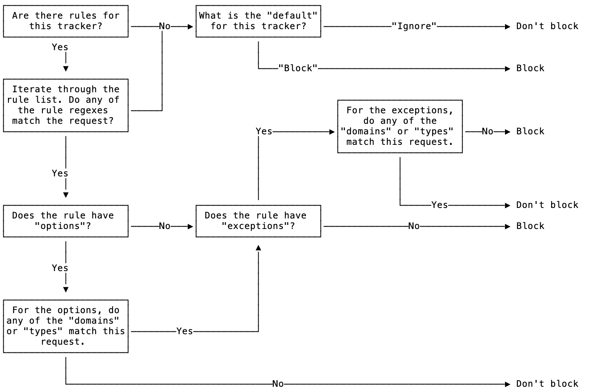

# DuckDuckGo Tracker List


Trackers are third party assets that are known to share personal information, either through the operation of script or the request of the resource itself.

This list will identify which of those requests to block, or in some cases, substitute.

The list consists of domains to match against asset requests, and specific rules - both blocking and whitelists - to match against the full URL, as well as exceptions and default conditions, to determine whether the URL is a tracker and can be blocked.

---

The following algorithm will help explain the list and how to use it correctly:

1. For each third party asset request on the page, take the hostname of a request, including subdomains, and check for a corresponding key in the tracker list. Continue removing subdomains until a match is found or you no longer have a valid hostname. 

- If no match is found, don't block.

2. If a match is found:

- 2a. If the tracker entry has rules
    - Loop through the rule list and apply a global regex match with the full request URL using each rule.
        - If a rule match is found:
          
            1. If there are rule 'options', do the domains and request types match this request? (see note on option matching)
                - Yes: go to exception matching below
                - No: Don't Block
                
            2. If there are rule 'exceptions', do any of the domains and request types match this request? (see note on option matching)
                - Yes: Don't block
                - No: Block
		
        - If no rule match was found go to 2b.

- 2b. If the tracker entry does not have rules or no rules matched this request
    - If the 'default' option is set to 'ignore' then don't block
    - If the 'default' option is set to 'block' then block the request
	
### Option matching

Rule options and exceptions can have both a list of domains and a list of request types. The domains in the `domains` list should match on all subdomains. For example, if `a.site.com` is in your domains list, then it should match for `b.a.site.com` but not on `site.com`. This allows you to add options and exceptions that apply to all subdomains of a site.  

### Request types

For a full list of valid request types see: [webRequest.ResourceType](https://developer.mozilla.org/en-US/docs/Mozilla/Add-ons/WebExtensions/API/webRequest/ResourceType)

---



---

## Examples

### Tracker with no rules but default 'block'.

This tracker doesn't have any rules and has a default set to 'block'. We will block all third party requests from this tracker.

```
{
    "domain": "aolcdn.com",
    "default": "block",
    "owner": {
    	"name": "AOL"
    }
 }
```

|  Site | Request URL  | Request type | Block | Reason |
|---|---|---|---|---|
| abc.com | aolcdn.com/ad.js | script  |  true | default set to 'block' |


### Tracker with rules and default 'block'

Default is set to 'block' so we will block all third party requests that don't match one of the rules. The first rule doesn't have any 'options' or 'exceptions' so we block all matching requests. It also has a surrogate<sup>[1](#surrogate)</sup> listed which, if the client supports, can be substituted in place of the request.
The second rule is limited to blocking all matching requests except for image 'types'.

<sup><a name="surrogate">1</a></sup> <sub>Certain tracking scripts are implemented in a way that attaches function calls to page elements. When these scripts are blocked, they break sites. In order to block these trackers while still maintaining site functionality, we redirect the requests to surrogate code that replaces all of their functions with no-ops.</sub>

```
{
    "domain": "doubleclick.net",
    "rules": [
        {
            "rule": "doubleclick\\.net\\/instream\\/(.*\\/)?ad_status\\.js",
            "surrogate": "ad_status.js"
        },
        {
            "rule": "doubleclick\\.net\\/ddm\\/",
            "exceptions": {
                "types": [
                    "image"
                ]
            }
        }
    ],
    "default": "block",
    "owner": {
        "name": "Google"
    }
 }
```

|  Site | Request URL  | Request type | Block | Reason |
|---|---|---|---|---|
| yahoo.com | doubleclick.net/instream/1234/ad_status.js |  script |  true | matches rule |
| abc.com | doubleclick.net/ddm/ | script  |  true | matches rule |
| abc.com | doubleclick.net/ddm/ | image  |  false | matches rule but also matches exception |
| abc.com | doubleclick.net/adimage.png | image  |  true | defaut is set to 'block' |

### Tracker with options and exceptions

The default is set to 'ignore' so we only block requests that match a rule. The first rule doesn't have any 'options' or 'exceptions' so we will block any matching request. The second rules had a blocking domain option. We will only block matching requests that come from `videos.dailymotion.com` or its subdomains. This rule also has an exception for image types so we don't block any matching image requests.

```
{
    "domain": "facebook.net",
    "rules": [
        {
            "rule": "connect\\.facebook\\.net\\/signals\\/"
        },
        {
            "rule": "facebook\\.net[?/].*\\/AudienceNetworkVPAID\\.",
            "options": {
                "domains": [
                    "videos.dailymotion.com"
                ]
            },
	    "exceptions": {
	    	"types": [
		    "image"
		]
	    }
        }
    ],
    "default": "ignore",
    "owner": {
        "name": "Facebook"
    }
 }
```

|  Site | Request URL  | Request type | Block | Reason |
|---|---|---|---|---|
| yahoo.com | connect.facebook.net/signals/ |  script |  true | matches rule |
| yahoo.com | facebook.net/tracker.js |  script |  false | default set to 'ignore' |
| google.com | facebook.net/123/AudienceNetworkVPAID.js | script  |  false | does not match domain options |
| dailymotion.com | facebook.net/123/AudienceNetworkVPAID.js | script  |  false | does not match domain options |
| videos.dailymotion.com | facebook.net/123/AudienceNetworkVPAID.js | script  |  true | matches domain options |
| videos.dailymotion.com | facebook.net/123/AudienceNetworkVPAID.png | image  |  false | matches domain options but also exception type |
