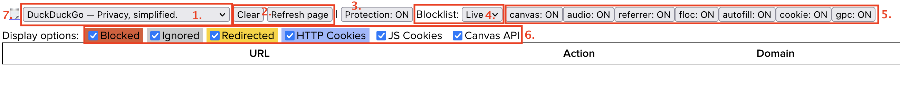
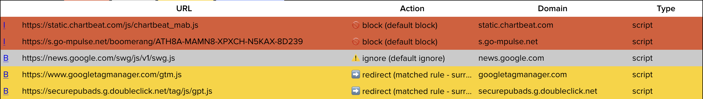
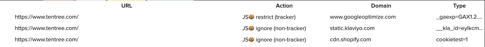

# Protection Debugging

The extension ships with many different protections and figuring out which one is active on a site, or which may be causing a problem with a specific site can be tricky. For this purpose we include a debugging panel that allows you to:
 * observe which requests are blocked or redirected and which cookies are blocked;
 * see when protections for Javascript APIs, such as `document.cookie` and Canvas APIs are triggered;
 * toggle specific protections on and off on a specific page; and
 * modify blocking rules to observe the effect on the page.

The panel can be accessed from extension popup by clicking the cog in the top right and then on 'Protection Debugger Panel'. This option is only shown in non-release versions of the extension. In these cases the panel can be reached by typing the extension URL directly. The easiest way to do this would be to go to the Settings page from the extension popup, then change `options.html` to `devtools-panel.html`.

## Protection Debugger Panel

### Controls

The header portion of the debugger panel shows the follow options:
 1. Tab selector: choses which tab the panel should monitor.
 2. Clear: removes entries in the table. Reload page: clears entries and triggers a reload of the monitored page.
 3. Protection toggle: shows if protections are globally enabled or disabled, and allows this to be toggled.
 4. Blocklist selector: allows switching between blocklist versions.
 5. Feature toggles: shows if specific protections are enabled on the current page, and allows them to be toggled (requires page reload).
 6. Display filters: allows filtering of which debugging events are shown in the table.
 7. List editor: link to open the list editor.

### Row data

Each row in the debugger table shows an event that the extension detection and could have taken a action for. The information show depends on the event type.

#### Tracker Requests blocked/ignored/redirected

These are requests in the page that the extension matched against our tracker list. Matched requests can then be blocked, ignored (not-blocked), or redirected (e.g. to a surrogate). The table columns for these types of event are:
 1. 'I' or 'B' - a button that allows you to toggle this rule. i.e. if the request is currently blocked, clicking 'I' will update the rule to ignore request matching the rule instead.
 2. Request URL.
 3. Domain: the tracker domain. If this is a CNAME tracker the resolved CNAME domain will be shown here rather than the request domain.
 4. Action: block, ignore or redirect, followed by more detail, typically whether a default or exception rule was matched.
 5. Request type.

#### HTTP Cookies blocked

HTTP Cookie blocked events show when outgoing ('Cookie') or incoming ('Set-Cookie') cookie headers have been blocked by the extension. The row columns are the same as for tracker requests except:
 * There are no rule toggle links.
 * The domain column shows which headers were removed from requests.

#### JS Cookie restrictions

The extension's cookie protections restrict the expiry of some cookies. When a first party cookie is set or modified events are shown as above. The data shows:
 1. URL: the document URL that the cookie was set in (i.e. what will be the cookie's domain).
 2. Action: restrict or ignore, with a reason.
 3. Domain: the script domain(s) that set the cookie.
 4. Type: the value of the set cookie.

#### Canvas Fingerprinting protections

When a script on the page tries to use canvas APIs associated with fingerprinting, an event is shown with:
 1. URL: the document URL where the call was made.
 2. Action: restrict or ignore.
 3. Domain: the intercepted function call (`getImageData` or `toDataURL`).

